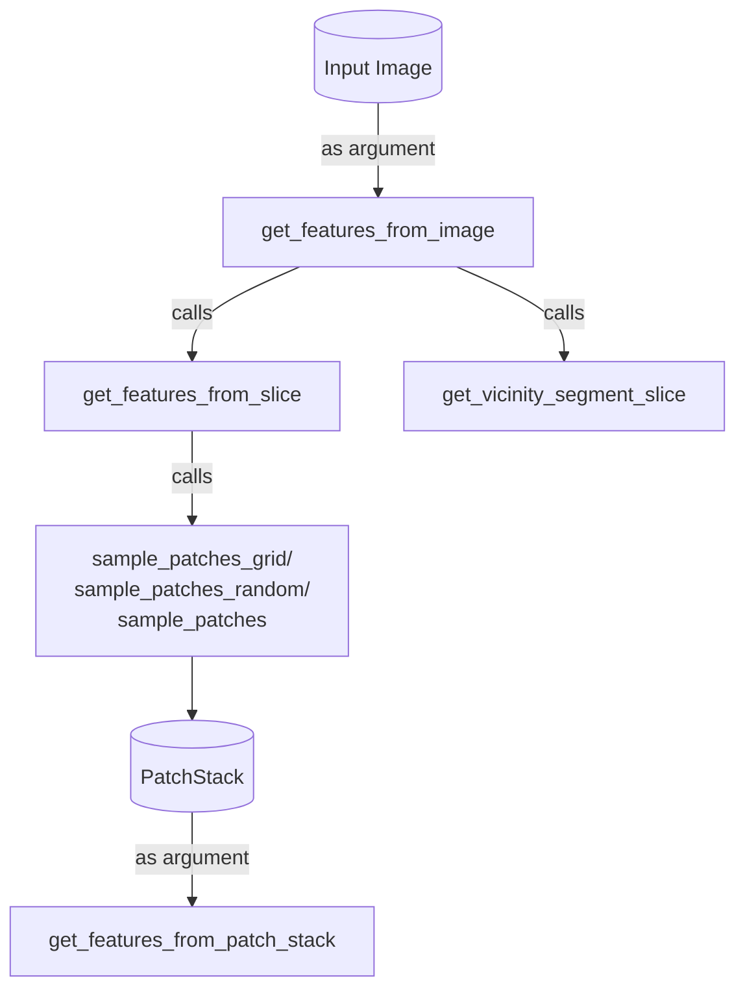

# Introduction

## Purpose of project

The aim of this project is to come up with a system to compare and contrast the textures of two arbitrarily specified regions on an image, without regarding their morphologies.The ultimate goal is to enable comparison between two images of body tissues, and evaluate the textural similarity between them. The assumption is that similar tissues should present similar texture quantifier.

## Existing methodologies

In the field of computer vision and medical imaging, several techniques are employed to match textures between two images, some examples includes:

* **Feature-based methods**
* **Template matching**
* **Histogram-based methods**
* **Neural networks and deep learning**
* **Mutual information**

However, biological tissues can be highly irregular and diverse, presenting a significant challenge for conventional techniques. The inherent non-homogeneity of tissue means that textures can vary greatly within the same image or between images of the same type of tissue. Traditional methods like histogram matching or template matching might fail to capture these variations accurately.

Although deep learning method seems to be the most direct solution of this issue, this project intend to focuses on more general methods that can work on multiple tissues with out requirement of long training time and data collection.

# Usage

## main.py

The code in `main.py` processes medical images and their segmentation masks to extract features. It expects input NIfTI files and segmentation masks identified by 
unique IDs. The IDs are identified from the filename using regexp. 

The primary purpose of the pipeline is to process 3D medical images (e.g., NIfTI files) slice by slice, extract features from specified regions of interest (ROIs), and optionally include features from nearby (vicinity) regions. The main workflow includes preprocessing segmentation masks (e.g., dilation, erosion, hole-filling), extracting features using patches of configurable size via grid or random sampling, and saving the results in HDF5 format. 

The extracted features are computed using `PyRadiomics`, with support for advanced configurations *through a settings file*. The code includes utilities for handling segmentation misalignments, resampling, and managing image metadata. It also provides visualization tools for bounding boxes and extracted patches, ensuring the pipeline is robust for tasks like tumor characterization, treatment planning, or texture analysis in medical imaging. The pipeline is modular, allowing integration into larger workflows and enabling multi-threaded processing for efficiency.

```mermaid
graph TD
    subgraph Setup
        A1[Initialize logger] --> A2[Create output directory]
        A3{Include vicinity?} -->|Yes| A4[Set dilation and shrink pixels]
        A3 -->|No| A5[Skip vicinity settings]
        A2 --> A3
    end

    subgraph Input["Input & ID Matching"]
        B1[Get input NIfTI files] --> B2[Get segmentation NIfTI files]
        B3[Extract unique IDs from input] --> B4[Extract unique IDs from segmentation]
        B2 --> B3
        B5[Find intersection of IDs] --> B6{ID list provided?}
        B6 -->|Yes| B7[Filter intersection by ID list]
        B6 -->|No| B8[Use intersection as ID list]
        B4 --> B5 --> B6
    end

    subgraph MainWorkflow
        C1[Load supervised pairs by IDs] --> C2[Sort and pair input/segment files]
        C2 --> C3[Iterate over each pair]
        C3 --> C4{Output file exists?}
        C4 -->|Yes| C5{Key exists in HDF5?}
        C5 -->|Yes| C6[Skip processing]
        C5 -->|No| D1
        C4 -->|No| D1[Load image and segmentation]

        subgraph Preprocessing
            D1 --> D2{Normalization enabled?}
            D2 -->|Yes| D3[Check normalization settings]
            D2 -->|No| E1[Extract class from segmentation]
            D3 --> E1
            E1 --> E2[Convert segmentation to binary mask]
            E2 --> E3{Tweak extraction?}
            E3 -->|Yes| E4[Apply dilation/erosion]
            E3 -->|No| E5[Skip tweaks]
            E4 --> E6[Apply binary opening]
            E5 --> E6
        end

        subgraph FeatureExtraction
            E6 --> F1{Image and Segmentation aligned?}
            F1 -->|Yes| F2[Extract features]
            F1 -->|No| F3[Resample segmentation]
            F3 --> F2
        end

        subgraph SaveFeatures
            F2 --> G1[Save features to HDF5]
            G1 -->|Overwrite enabled?| G2[Update HDF5 key]
            G1 -->|No overwrite| G3[Warn about potential inflation]
        end

        C6 --> C7[Process next pair]
        G2 --> C7
        G3 --> C7
    end

    Setup --> Input --> MainWorkflow
```

## Sampling grid

## Extracting features

# Data License

Data for python unittest were downloaded as per instruction here: https://torchio.readthedocs.io/datasets.html

See https://nist.mni.mcgill.ca/pediatric-atlases-4-5-18-5y/ for more details.

# Notes

Please note that owing to limitations of github, LFS objects are uploaded as place holders and uploaded elsewhere. If you are unable to obtain them by cloning this repo, please contact me.
